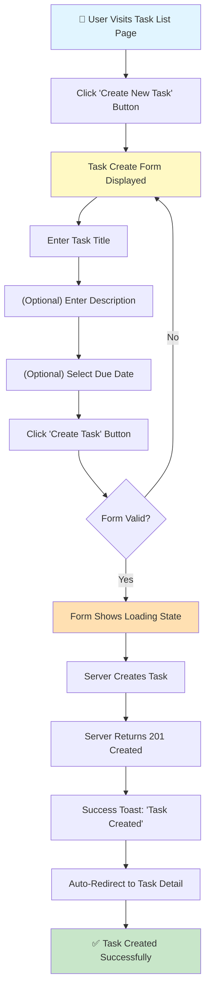
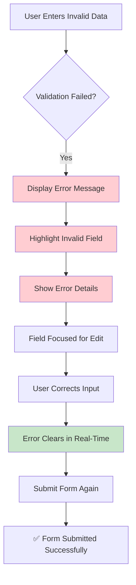
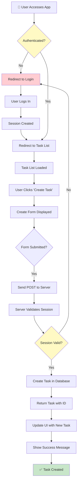
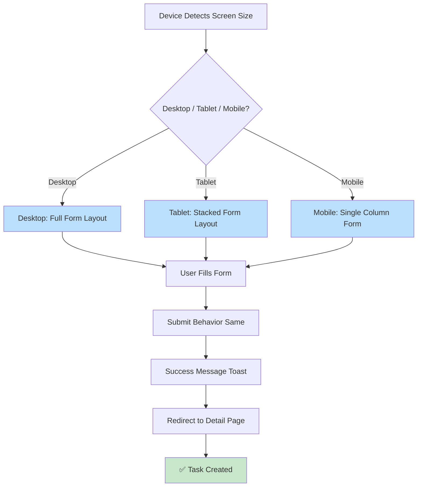
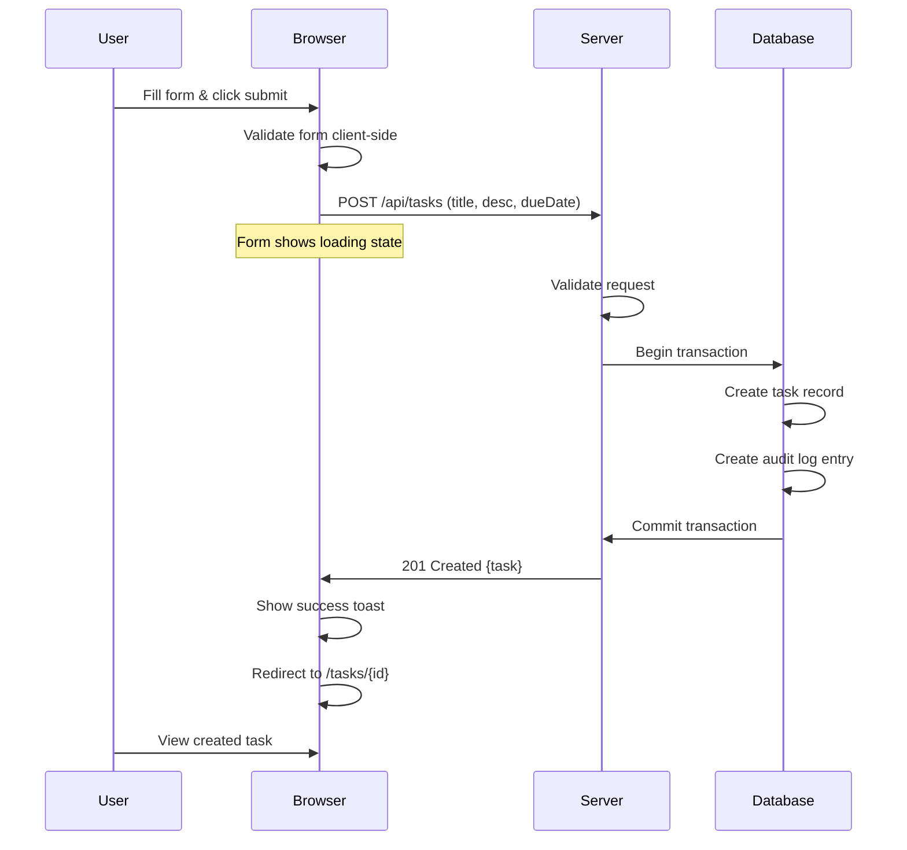
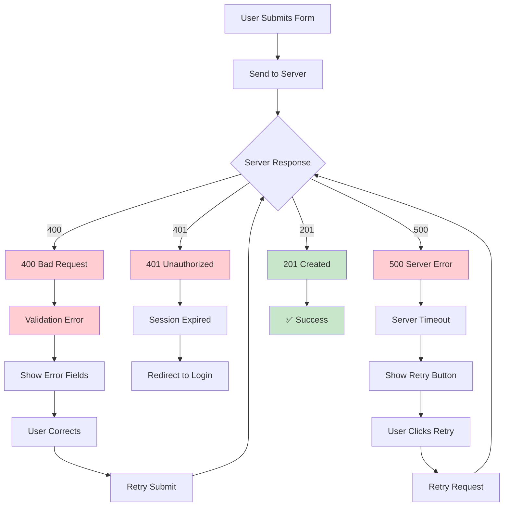
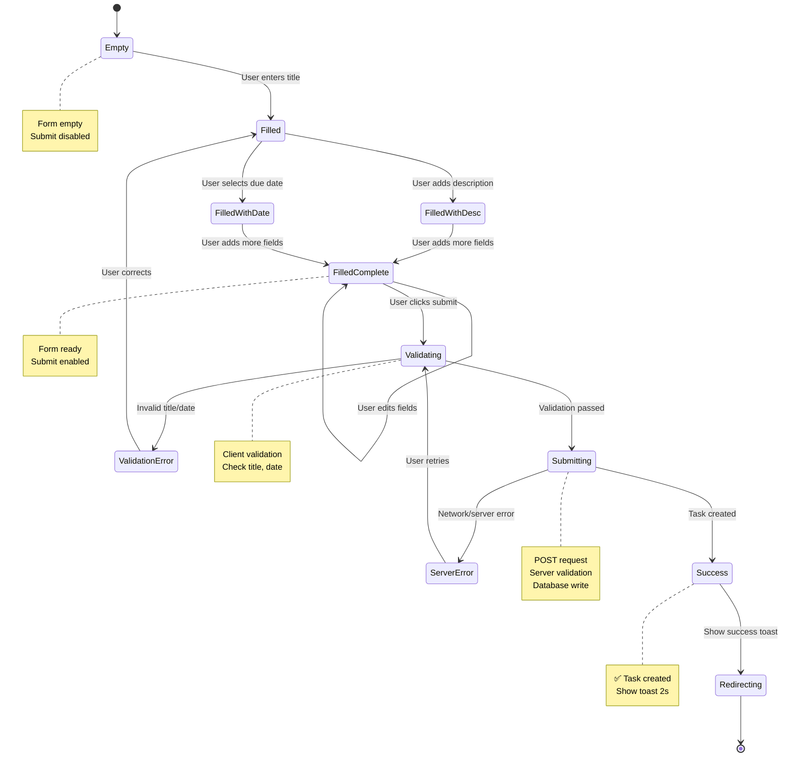
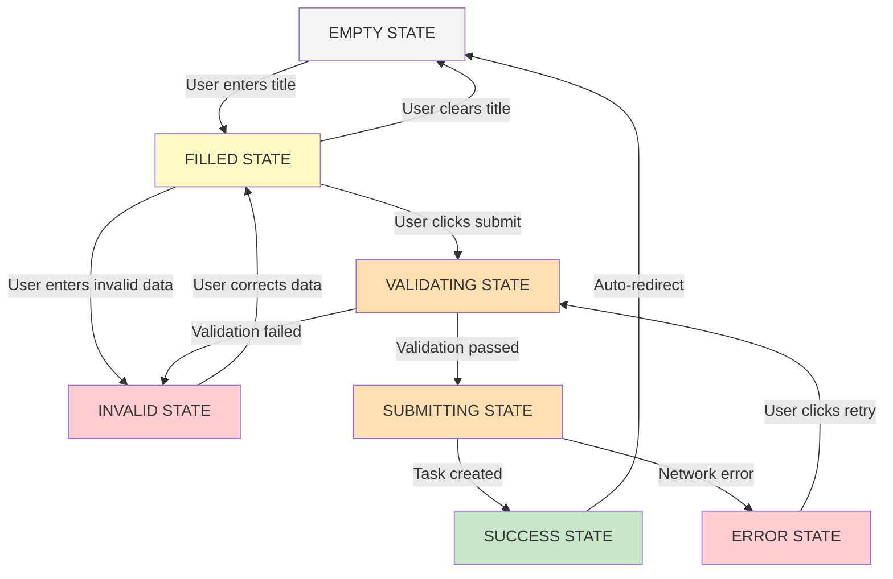
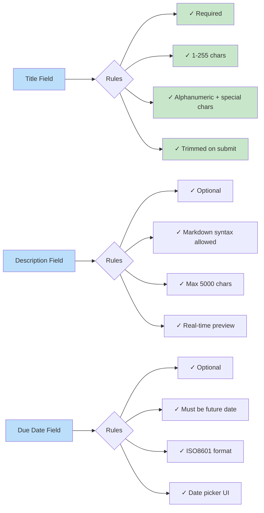
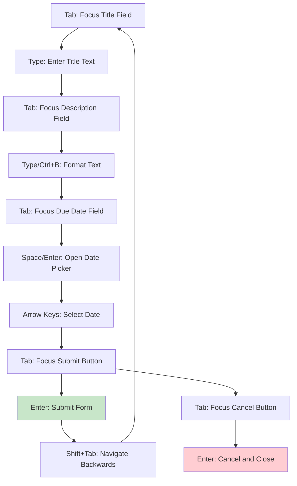

# User Journey Map: Create Individual Task
## UN-1 - Foundation Story - UX/UI Architecture

**Document Version:** 1.0  
**Created:** July 2, 2026  
**Story:** UN-1: Create individual task  
**User Persona:** Team Member  
**Primary Goal:** Break down project work into manageable task items  

---

## 📊 Primary User Flow: Happy Path

---

## 🔀 Alternative Flow: Validation Error Recovery

---

## 🌐 Browser-Based Flow: Authentication & Session

---

## 📱 Responsive Behavior Flow

---

## ⏱️ Timeline Flow: Concurrent Submissions

---

## 🔄 Error Handling Flow

---

## 🎯 Task Creation State Machine

---

## 🎨 UI State Transitions

### Form States

---

## 📋 Field Validation Rules

---

## 🎯 Accessibility Flow: Keyboard Navigation

---

## 📊 User Journey Metrics

### Successful Path Metrics
- **Time to Fill Form:** 30-60 seconds (average)
- **Time to Submit:** 2-5 seconds
- **Server Processing:** <200ms (p95)
- **Redirect Time:** <500ms
- **Total Flow Duration:** 35-65 seconds

### Error Path Metrics
- **Error Detection:** <100ms (client-side)
- **Error Display:** <50ms
- **User Correction:** 10-30 seconds
- **Retry Attempt:** <5 seconds
- **Total Error Recovery:** 15-40 seconds

### Accessibility Metrics
- **Keyboard Navigation:** All fields accessible
- **Screen Reader Support:** All labels announced
- **Color Contrast:** WCAG 2.1 AA compliant
- **Focus Indicators:** Visible on all interactive elements

---

## 🎬 Wireframe Files Generated

The following wireframe HTML files have been generated in `/wireframes`:

1. **001-task-list-page.html** - Task list with "Create Task" button
2. **002-create-form-empty.html** - Empty form state
3. **003-create-form-filled.html** - Filled form ready to submit
4. **004-create-form-validation-error.html** - Form with validation errors
5. **005-create-form-loading.html** - Form in loading state
6. **006-success-toast.html** - Success notification component
7. **007-task-detail-page.html** - Created task detail view
8. **008-responsive-mobile.html** - Mobile responsive layout
9. **009-responsive-tablet.html** - Tablet responsive layout
10. **010-date-picker-popup.html** - Date picker component

---

## 🎨 Design System Integration

### Color Palette
- **Primary Action:** #1976D2 (Blue)
- **Success State:** #388E3C (Green)
- **Error State:** #D32F2F (Red)
- **Warning State:** #F57C00 (Orange)
- **Background:** #FFFFFF (White)
- **Text Primary:** #212121 (Dark Gray)
- **Text Secondary:** #757575 (Gray)
- **Disabled:** #BDBDBD (Light Gray)
- **Borders:** #E0E0E0 (Light Gray)

### Typography
- **Headline:** Manrope, 20px, Bold
- **Label:** Manrope, 14px, Regular
- **Body:** Manrope, 14px, Regular
- **Helper Text:** Manrope, 12px, Regular

### Spacing
- **Padding Input:** 12px 16px
- **Gap Between Fields:** 16px
- **Button Height:** 40px
- **Form Width:** max 600px

### Components Used
- Text Input Fields
- Textarea (Markdown editor)
- Date Picker
- Primary/Secondary Buttons
- Toast Notification
- Loading Spinner
- Error Messages
- Helper Text

---

## ✅ Validation Feedback UX

### Real-Time Validation (As User Types)
- Title field: Character count (0/255)
- Title field: "Required" error if empty on blur
- Title field: "Too long" error if >255 chars
- Description: Markdown preview on right side
- Due Date: "Must be future date" error if invalid

### On Submit Validation
- All required fields checked
- All field formats validated
- Date comparison (due date > today)
- Submit button disabled during request
- Optimistic UI update (task appears in list)

### Error Messages
- **Required Field:** "This field is required"
- **Invalid Format:** "Please enter a valid {field name}"
- **Too Long:** "Must be 255 characters or less"
- **Invalid Date:** "Please select a future date"
- **Network Error:** "Unable to save. Please try again."
- **Server Error:** "Something went wrong. Please try again."

---

## 🚀 Performance Optimizations

### Frontend Optimizations
- **Form Rendering:** <100ms
- **Input Validation:** <50ms per keystroke
- **Markdown Preview:** Debounced 300ms
- **Submit Debounce:** Prevent double-submit
- **Optimistic UI:** Instant feedback

### Backend Optimizations
- **Database Transaction:** Atomic operation
- **Indexing:** On owner, status fields
- **Caching:** Audit log batched writes
- **Response Time:** <200ms (p95)

### Network Optimizations
- **Minified Requests:** JSON payloads <5KB
- **Compression:** gzip enabled
- **Connection Reuse:** Keep-alive
- **Retry Logic:** Exponential backoff

---

## 📱 Responsive Breakpoints

### Desktop (1024px+)
- Form side by side with preview
- Full width textarea
- Inline date picker
- Wide submit button

### Tablet (768px - 1023px)
- Stacked form layout
- Full width fields
- Modal date picker
- Full width buttons

### Mobile (< 768px)
- Single column layout
- Full width fields
- Bottom sheet date picker
- Bottom sheet keyboard
- Full height buttons

---

## ♿ Accessibility Compliance

### WCAG 2.1 Level AA
- ✅ Proper label associations (for/id)
- ✅ ARIA attributes (aria-required, aria-invalid)
- ✅ Keyboard navigation support
- ✅ Focus indicators visible
- ✅ Color contrast ≥4.5:1
- ✅ Error messages associated with fields
- ✅ Form instructions provided
- ✅ Submit button clearly labeled

### Screen Reader Support
- ✅ Form landmark: `<form role="form">`
- ✅ Fieldset for grouping: `<fieldset>`
- ✅ Legend for form instructions
- ✅ Input labels: `<label for="id">`
- ✅ Error messages announced: `aria-describedby`
- ✅ Loading state announced: `aria-busy="true"`
- ✅ Success toast announced: `role="status"`

---

## 🎯 Key Interaction Patterns

### Primary CTA (Create Task Button)
- **State:** Enabled when title provided
- **Hover:** Background darkens
- **Active:** Background darker
- **Disabled:** Gray, cursor not-allowed
- **Loading:** Shows spinner, text disappears

### Input Field Behavior
- **Focus:** Border color changes to primary
- **Error:** Border color changes to red
- **Valid:** Border color changes to green
- **Disabled:** Grayed out, cursor not-allowed
- **Placeholder:** Visible only when empty

### Form Validation Feedback
- **Real-time:** On blur (after user leaves field)
- **Inline:** Below each field
- **Contextual:** Explains what's wrong
- **Actionable:** Shows what to fix
- **Color-coded:** Red for error, green for valid

---

## 🔄 Microinteractions

1. **Button Hover:** Subtle shadow increase
2. **Field Focus:** Border color animation (200ms)
3. **Success Toast:** Slide in from top (300ms)
4. **Error Shake:** Field shake animation (500ms)
5. **Loading Spinner:** Rotating animation
6. **Character Counter:** Updates in real-time
7. **Markdown Preview:** Smooth preview update
8. **Date Picker:** Dropdown slide animation

---

## 📊 Success Criteria

- ✅ Form renders in <100ms
- ✅ Validation feedback in <50ms
- ✅ Submit request in <5s (user-perceived)
- ✅ Task creation in <200ms (server)
- ✅ Redirect in <500ms
- ✅ All interactions keyboard accessible
- ✅ All colors meet contrast requirements
- ✅ Responsive on all device sizes
- ✅ Works with/without JavaScript
- ✅ Works with all modern browsers

---

## 📚 Reference Links

- **JIRA Story:** https://jitenderlnu.atlassian.net/browse/UN-1
- **Prisma Schema:** See SPRINT_1_UN_1_WORKSPACE.md
- **API Specification:** See SPRINT_1_UN_1_WORKSPACE.md
- **Design System:** DataDog dark mode compatible

---

**Document Status:** Complete ✅  
**Wireframes Generated:** 10 HTML files  
**User Flows Documented:** 7 Mermaid diagrams  
**Ready for Development:** Yes

*UX/UI Architecture Complete - Ready for Frontend Implementation*
